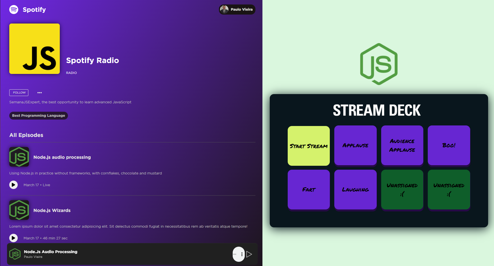

# Spotify Radio

Este é o código inicial do spotify-radio.

Marque esse projeto com uma estrela 🌟

## Preview

## Checklist Features

- Web API
    - [x] Deve atingir 100% de cobertura de código em testes
    - [x] Deve ter testes de integração validando todas as rotas da API
    - [x] Deve entregar arquivos estáticos como Node.js Stream
    - [x] Deve entregar arquivos de música como Node.js Stream
    - [x] Dado um usuário desconectado, não deve quebrar a API
    - [x] Mesmo que vários comandos sejam desparados ao mesmo tempo, não deve quebrar a API
    - [x] Caso aconteça um erro inesperado, a API deve continuar funcionando
    - [x] O projeto precisa ser executado em ambientes Linux, Mac e Windows

- Web App 
    - Client
        - [x] Deve reproduzir a transmissão
        - [x] Não deve pausar se algum efeito for adicionado
    - Controller
        - [x] Deve atingir 100% de cobertura de código em testes
        - [x] Deve poder iniciar ou parar uma transmissão 
        - [x] Deve enviar comandos para adicionar audio efeitos à uma transmissão

## Tarefas

- 01: Cobrir as camadas service e route com testes unitários e alcançar 100% de code coverage
- 02: Manter 100% de code coverage e implementar testes e2e para toda a API
- 03: implementar testes unitários para o frontend e manter 100% de code coverage
- **PLUS**: 
    - [x] disponibilizar um novo efeito
        - [x] adicionar um botão novo no controlador
        - [x] adicionar um som de efeito novo para a pasta `audios/fx/`

### Camadas do server
- server
  - service = regra de negócio ou processamento
  - controller = intermediar a camada de apresentação e a camada de negócio
  - routes = camada de apresentação 
  - server = responsavel por criar o servidor (mas não instância)
  - index = instância o servidor e expõe para a web (lado da infraestrura)
  - config = tudo que for estático do projeto

### Camadas public
- project
    - service = negócio ou processamento
    - controller = intermédio entre a view e service
    - view = elemento HTML (visualização)
    - index = incia tudo (Factory)

## FAQ 
- `NODE_OPTIONS` não é um comando reconhecido pelo sistema, o que fazer?
    - Se você estiver no Windows, a forma de criar variáveis de ambiente é diferente. Você deve usar a palavra `set` antes do comando. 
    - Ex: `    "test": "set NODE_OPTIONS=--experimental-vm-modules && npx jest --runInBand",`
